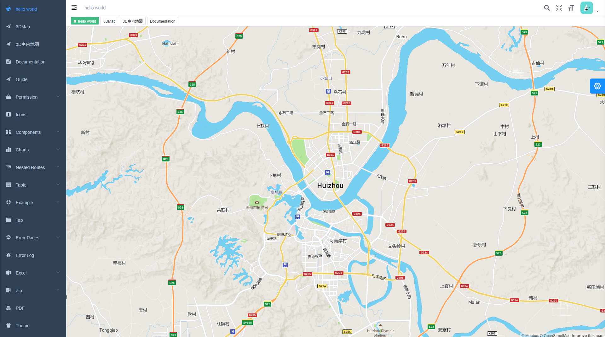
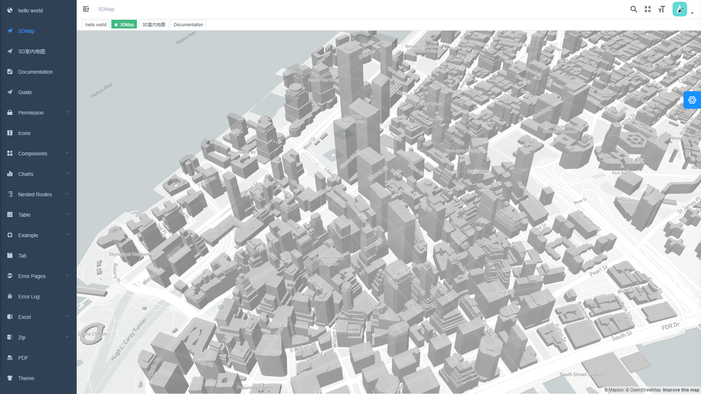
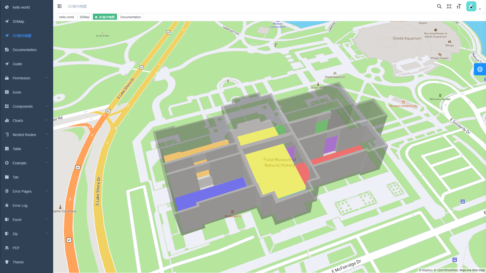
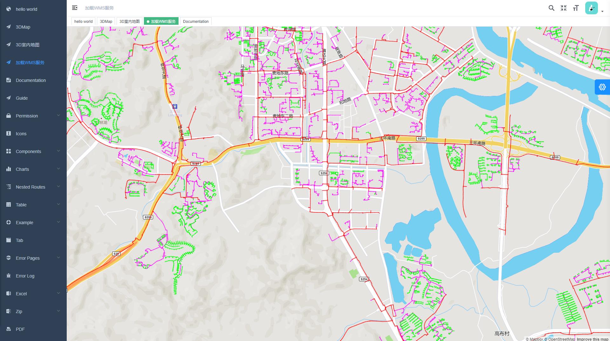
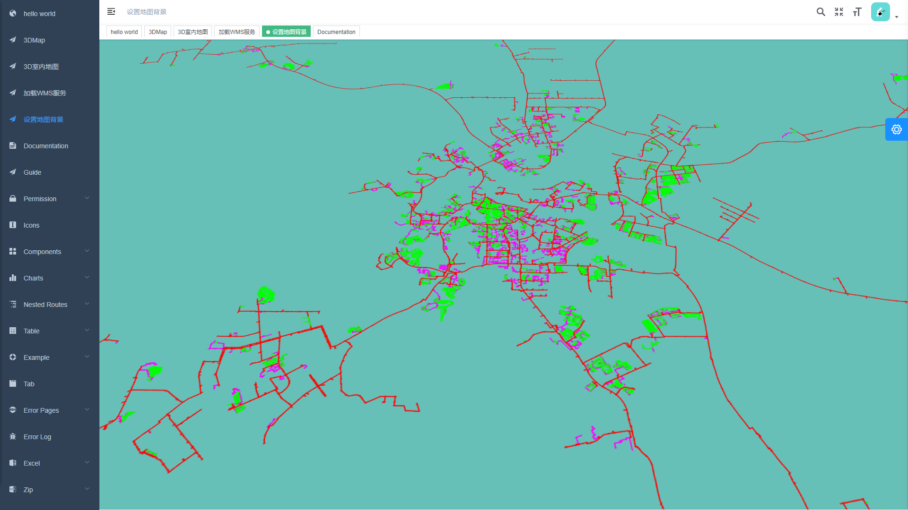

<!--
 * @Descripttion: 
 * @Author: jiegiser
 * @Date: 2020-03-25 17:46:55
 * @LastEditors: jiegiser
 * @LastEditTime: 2020-03-26 15:57:40
 -->

## 介绍

基于 mapbox + Vue 实现的一些例子

### 1. Hello World（√）

### 2. 3D 地图（√）

### 3. 3D 室内地图（√）

### 4. 加载geoserver WMS服务（√）

### 5. 设置地图背景（√）

